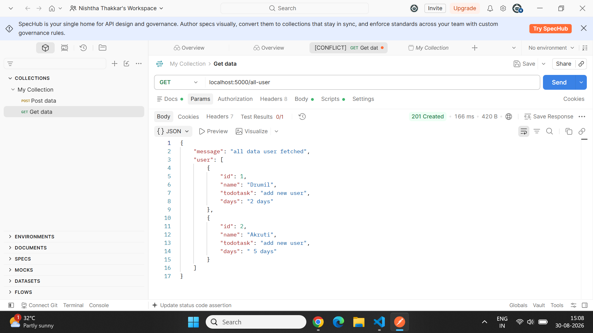

Node.js To-Do List REST API

📌 Project Overview

This is a beginner-level Node.js + Express.js REST API project for
managing users and their to-do task information.

The project demonstrates the basic CRUD operations used in REST APIs:

GET -- Fetch data

POST -- Add new data

PUT -- Update all data

PATCH -- Update specific data

DELETE -- Delete data

The API uses an in-memory JavaScript array, so the data is stored
temporarily while the server is running.

🛠️ Technologies Used

Node.js

Express.js

JavaScript

Postman -- API testing

VS Code

📁 Project Structure

To-do-list-project/
│
├── node_modules/
├── package.json
├── package-lock.json
├── server.js
└── README.md

⚙️ Installation and Setup

1. Clone or download the project

Open the project folder in VS Code.

2. Install dependencies

Run:

npm install

3. Start the server

Run:

node server.js

If the server starts successfully, you will see:

server is working...

The server runs on:

http://localhost:5000

🔗 API Endpoints

1. Get All Users

Method

GET

URL

http://localhost:5000/all-user

Description

Fetches all users from the array.

2. Add New User

Method

POST

URL

http://localhost:5000/add-user

Body

Select Body → raw → JSON in Postman.

{
  "name": "Jalpa"
}

Description

Adds a new user to the user array.

3. Get User By ID

Method

GET

URL

http://localhost:5000/user/1

Description

Fetches one specific user using the user ID.

Example:

/user/1

returns the user whose ID is 1.

4. Update All User Data

Method

PUT

URL

http://localhost:5000/update-all-user/1

Body

{
  "name": "Drumil Patel",
  "todotask": "Complete Node.js project",
  "days": "10 days"
}

Description

PUT is used to update the complete user information.

5. Update Specific User Data

Method

PATCH

URL

http://localhost:5000/patch-update/2

Body

For example, to update only the name:

{
  "name": "Jalpa"
}

Description

PATCH is used when only a specific field needs to be updated.

6. Delete User

Method

DELETE

URL

http://localhost:5000/user-delete/2

Description

Deletes the user with the specified ID.

🧪 API Testing

All API endpoints were tested using Postman.

The project includes testing for:

GET all users

GET user by ID

POST new user

PUT complete user update

PATCH specific field update

DELETE user

📸 Screenshots

Add your Postman screenshots below.

Note: Create a screenshots folder inside the project and put
your screenshots there. Rename the image files according to the names
used above.

🎥 Project Video

Add your project demonstration video link here.

Project Video:
PASTE YOUR VIDEO LINK HERE

For example:

(https://drive.google.com/file/d/1kDKCkw8ZRTMPBCamAKNn4RDBZDVpHxFB/view?usp=drive_link)

🖥️ Screen Recording

Add your complete project screen-recording link here.

Screen Recording:
(https://drive.google.com/file/d/1IBZuPle5Z9J4wHCvpTYxv6_T7lUNbJbO/view?usp=drive_link)

📚 What I Learned

Through this project, I learned:

How to create an Express.js server.

How to use express.json().

How to create GET routes.

How to create POST routes.

How to get route parameters using req.params.

How to get request body data using req.body.

How to use find() to find a specific user.

How to use filter() for delete-related operations.

Difference between PUT and PATCH.

How to test REST APIs using Postman.

How HTTP methods are used in CRUD operations.

🔄 CRUD Operations

Operation              HTTP Method   Endpoint

Read all users         GET           /all-user
Create user            POST          /add-user
Read one user          GET           /user/:id
Update all data        PUT           /update-all-user/:id
Update specific data   PATCH         /patch-update/:id
Delete user            DELETE        /user-delete/:id

👩‍💻 Author

Nishtha Thakkar

Beginner Node.js & Express.js Project

⭐ Project Status

Completed as a beginner-level REST API practice project using Node.js
and Express.js.